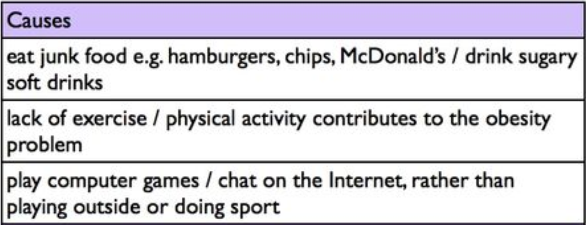
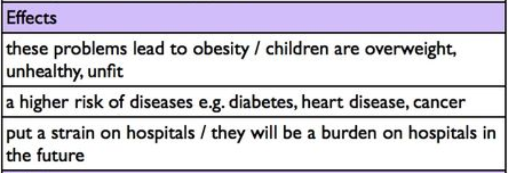
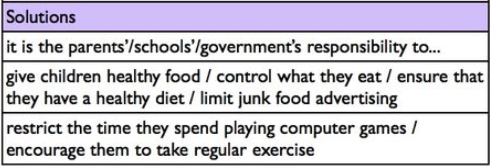

## Sentences

- Topic + Action or state
- Subject + Predicate

## Sentence Structure: SS1

> Subject + Intransitive Verb (V.i)

### Wrong example

> I am discussing **(V.t.)** ~~about~~ academic writing.

> The weather affect **(V.t.)** ~~to~~ our mood.

> I am waiting **(V.i)** for you.

> I am awaiting **(V.t.)** ~~for~~ you.

### Trick

    lead to + N
    
    cause + N
    
    result in + N
    
    bring about + N

## Sentence Structure: SS2

> Subject + Transitive Verb (V.t) + Object

### Trick

    A affects B
    
    discuss ~~with~~
    
    enjoy ~~with~~

## Sentence Structure: SS3

> Subject + Verb + Object 1 + Object 2

### Words

- give
- teach
- tell
- grant
- offer
- guarantee

### Example

    I shared my friends the photos of my son.

### Pattern

> 1. $SVO_1O_2$

> 2. $SVO_2prepO_1$

## Sentence Structure: SS4

> Subject + LInking Verb + complement

### SS4.1

> Subject + Linking Verb + Adjective (adj.)

### SS4.2

> Subject + Linking Verb + Noun (N.)

### SS4.3

> Subject + Linking Verb + Preposition Phrase (Prep. phrase)

## Ground rules

## Group 1 = $C_1$

- and
- but
- or

### Pattern

> SV, $c_1$sV.

## Group 2 = $C_2$

- because
- if
- when
- since
- as
- before
- after
- although

### Pattern

> 1. SV$c_2$sV.
>
> 2. $C_2$sV, sV.

## Group 3 = $C_3$

- moreover
- in addition
- furthermore
- also
- similarly
- however
- on the other hand
- therefore
- consequently
- thus
- for example
- for instance
- first / second / third / finally
- next / then / after that

### Pattern

> 1. SV. $C_3$, sV.
>
> 2. SV; $c_3$, sV.

## Introduction

- General Statement: 3-4 Sentences
  - mention the problem
  - grab attention of your audience
  - definition of the a problem / word
- Thesis Statement: 1 Sentence
  - answer the question
  - main idea of essay
  - scope your essay / direction

## Body Paragraph

1. Topic Sentence
   1. a complete sentence
   2. give direction of the paragraph
   3. controlling ideas
2. Supporting Sentence
   1. Sub-Supporting Sentence

### Trick
    There are some effects of unstable energy supply in some developing countries, which are $N_1$ and $N_2$.

## Topoi

### Problems / effects / issues

    - What are the causes and effects of the problem?
    = Can the causes and the effects of the problems be categorized into the local, national or global ones?
    - What or who are the specific groups that create and suffer from the problem? Can they be ranked in terms of severity?

### Solutions

    - What are the solutions to the problems?
    - Who will be responsible for implementation of the solution (doer of the action)?
    - How will the solutions be implemented by thr doer?
    - What are the benefits of the proposed solutions?
    - Can the benefits be categorized:
      - as local, national or global?
      - for specific groups of beneficiaries?
    - Can the benefits be ranked in terms of significance?

## Conclusion

1. signal the end
   1. In conclusion,
   2. In summary,
   3. To conclude,
2. paraphrase the main of the idea of the entire text (from the introductory paragraph) *restate-say the same thing in a different way*
3. summarize the main points from the body paragraphs

## Start Sentence Trick

    Over the past few decades,

    Nowadays,

    At present,

    These day,

## Noted

> Although~~,~~ &rarr; Although (not have comma)

> ~~can not~~ &rarr; cannot

> must not

> consider: S + consider + Obj1 + Obj2

> concerns

    1. V.t. = making + Obj + worried about + Subj.
   
    A concerns B
    = B is worried about A

    Your writing concerns me.
    = I am worried about your writing.

    2. N. [Count. Noun]

    Your writing is my concern.

    Global warming is a big concern among those in the field.

    3. adjective

    A is / am / are + concerned about B

    A is / am / are + worried about B

> around &rarr; approximately

> There are many effects of Covid-19 which are occurring in many countries.

> The first effect is solid waste because...

> The second effect is an economy.

> The last effect is health effects.

> Therefore, many tourist areas lack the people.

> really / tremendously / vastly / greatly

> well / potentially / effectively / efficiently

> big / enormous / acclaimed แปลว่า ใหญ่

> ไม่ค่อยจะ rarely / barely / hardly ใช้กับความถี่

> อย่างน้อย (บอกระดับ) slightly / insignificantly

> **ask for** help / assistance

> carefully / deliberately

> choose / opt / selecl

> expect / target

> consistent / relevant

> utilize / exert / employ

> higher / extra / further / additional

> larger number / proportion

> get / acquire / obtain

> advancements / advances

> everyday (adj.) / every day (adv.) / daily (adv.)

> urban ในเมือง / rural ขนบท

> effective / pleasant

> many / several / various / multiple

> change / solve / improve / alleviate

> ubiquitous / omnipresent / usual

> increasing / rising

> ways / manners / methods

> arrange / manage

> appropriate / proper / suitable / opportune

> product / merchandises / items / goods

> adequately / enough

> migration (N.) / migrate from (V.i.)

### Adv. (ly) ขยายประโยค / V. / Adj. / Adv. / ขยายอะไร มักจะวางหน้า หรือ หลังสิ่งนั้น

> ขยายกริยา วางหน้าหรือหลังก็ได้ ส่วนใหญ่นิยมวางหน้า

> ขยายประโยค วางหน้าหรือหลังก็ได้ ถ้าวางข้างหน้า ต้องมี comma: Adv.,S. + V.

> Will + Adv. + V.inf. / Adv. + Adv. / Adv. + Adj.

    The students potentially practice/prepare for the exam.

    These people are really/vastly friendly.

    Most people rarely ask for help/assistance from others unless they have seriously troubles.

## Words

    N. สาเหตุ: cause / factor / reason

    N. ผลกระทบ: effect / impact / result / consequence

    N. ปัญหา: problem / issue / difficulty / struggle / obstacle

    N. ทางแก้: solution / settlement

### Trick

    ทางแก้: ทางแก้ของเรื่องนี้คือการกระตุ้นเศรษฐกิจ

    N./V.ing/This (situation/circumstance) can be/must be/should be + (adv.อย่างมีประสิทธิภาพ) + V.3 แก้ไข + by N./V.ing.

    This circumstance can be potentially alleviated by stimulating the economy.

> they averagely spend one third of their lives on work.

> Since many countries are terrified of the Covid-19 pandemic.

## Noted Vocabulary

abuse: use (something) to bad effect or for a bad purpose; misuse.

pension: บำนาญ

burden: ภาระ

relatives: ญาติ

## Sentence Example

### Cause - Effect

> Pollution causes global warming.
> Pollution leads to global warming.
> Pollution results in global warming.
> Pollution is the main cause of global warming.
> Factories pollute the atmosphere. As a result, global warming is occurring.

### Effect - Cause

Global warming is caused by pollution.
Global warming is the result of pollution.
Global warming is due to pollution.
Global warming occurs as a result of pollution.

*Notice the different uses of 'result' (results in, is the result of, as a result). Students make a
lot of mistakes with these phrases.*

Humans are responsible for a variety of environmental problems, but we can also take steps to reduce the damage that we are causing to the planet.

Two of the biggest threats to the environment are air pollution and waste.

Gas emissions from factories and exhaust fumes from vehicles lead to global warming, which may have a devastating effect on the planet in the future.

As the human population increases, we are also producing ever greater qualities of waste, which contaminates the earth and pollutes rivers and oceans.

Governments cloud certainly make more effort to reduce air pollution. They could introduce laws to limit emissions from factories or to force companies to use renewable energy from solar, wind or water power.

They could also impose 'green taxes' on drivers and airline companies.

In this war, people would be encouraged to use public transport and to take fewer flights aboard, therefore reducing emissions.

Individuals should also take responsibility for the impact they have on the environment.

They can take public transport rather than driving, choose products with less packaging, and recycle as much as possible.

Most supermarkets now provide reusable bags for shoppers as well as 'banks' for recycling glass, plastic and paper in their car parks.

By reusing and recycling, we can help to reduce waste.

In conclusion, both national governments and individuals must play their part in looking after the environment.

### vegetarianism' topic

- Eating a hamburger a day can increase your risk of dying by a third.
- Raising animals in factory farm conditions is cruel.
- Meat production causes more emissions than transportation.

### children' topic

- The lack of closeness in families can have a negative effect on children.
- Many parents have no idea how their children spend their time.
- Friends, television and the Internet have become the main influences on children’s behavior.
- Teenagers are influenced by peer pressure.
- Juvenile delinquency is on the increase.
- Parents should be more involved with their children’s upbringing.
- Young people need positive role models.

### immigration' topic

From an economic perspective, immigration can be extremely positive. Many immigrants have skills that are needed in the country they move to. For example, countries sometimes lack key workers like doctors and nurses, and immigration is therefore encouraged. Immigrants who find work contribute to the economy of their new country with the skills they bring and the taxes they pay. At the same time, many immigrants send money to help family members in their home country, therefore helping to boost that economy too.

### crime topic

#### Causes of crime and re-offending

- The main causes of crime are poverty, unemployment and lack of education.
- People who commit crimes often have no other way of making a living.
- The prison system can make the situation worse.
- Offenders mix with other criminals who can be a negative influence.
- A criminal record makes finding a job more difficult.
- Many prisoners re-offend when they are released.

#### Possible measures to reduce crime and re-offending

- Prisons should provide education or vocational training.
- Rehabilitation programmes prepare prisoners for release into society.
- Community service is another way to reform offenders.
- It makes offenders useful in their local communities.
- They might be required to talk to school groups or clean public areas.
- Offenders also need help when looking for accommodation and work.

### city problems

- Life in cities has its drawbacks.
- The cost of living is higher than in rural areas.
- Housing is usually much more expensive.
- Homelessness and poverty are common in cities.
- There is a gap between the rich and poor.
- Life in cities can be extremely stressful.
- There are problems like traffic congestion and crime.
- Cities lack a sense of community.
- People do not even know their neighbours.
- Cities are sometimes described as “concrete jungles”.

### governments

- Governments provide public services like healthcare and education.
- They introduce new laws.
- They raise money by taxing working people.
- They can spend money on campaigns to educate people.
- They can raise people's awareness of issues.
- They can create new jobs.
- They can provide resources for schools, hospitals etc.
- They can support people who are living in poverty or unable to work.

### health topic

Lifestyle is a major cause of poor health in developed countries. Most people now travel by car rather than walking, and machines now perform many traditional manual jobs. As a result, people tend to work in offices where little physical activity is required. At home, people are also less active; most adults relax by watching television, while children play video games rather than doing outdoor sports. Technology has therefore made our lives more comfortable but perhaps less healthy.

### road safety topic

#### Causes

- Driving while tired or drunk is extremely dangerous.
- Mobile phones can be a dangerous distraction for drivers.
- They draw the driver’s attention away from the road.

#### Solutions

- The use of phones while driving has been banned in many countries.
- Punishments are becoming stricter.
- Television campaigns are used to remind people to drive safely.
- Speed cameras have become more common.

### job satisfaction topic

It is difficult to imagine a world in which everyone is truly satisfied with their job. Most people work in order to earn a salary, and they would probably not choose to spend eight or more hours each day doing their jobs if they did not need the money. The need to earn money to pay mortgages, bills and everyday living costs is of much greater concern than job satisfaction. In fact, I would argue that the majority of people dislike their jobs and are unhappy about their salaries, working hours, workloads, or their bosses.

### problem and solution

Behavior in schools is getting worse. Explain the causes and effects of this problem, and suggest some possible solutions.

Causes of bad behavior in schools

1. bad behavior / lack of discipline
2. large classes / difficult to teach
3. disruptive students / family background
4. parents / lenient / spoil

Possible solutions

1. schools / clear rules
2. teachers / punish disruptive students
3. parents / support / school rules
4. parents / take responsibility / children’s behavior

A good way to practice your writing is to try making full sentences with these ideas e.g. One reason for bad behavior is the lack of discipline in many schools.

### problem and solution (obesity)

Childhood obesity is becoming a serious problem in many countries. Explain the main causes and effects of this problem, and suggest some possible solutions.

### global warming topic

Here is a paragraph explaining the problem (causes) of global warming:

Perhaps the most serious problem facing the environment is global warming. Gases such as carbon dioxide trap heat from the sun within the earth’s atmosphere, and this causes global temperatures to rise. This process is known as the greenhouse effect, and human activity is a major factor in the rise of the greenhouse gases which cause it. For example, factories and vehicles produce emissions and exhaust fumes. As many developing countries are becoming industrialized, emissions from factories are expected to increase. Furthermore, the number of cars on our streets is growing all the time, and cheap air travel is making flying accessible to more and more people. Consequently, the amount of greenhouse gases released into the atmosphere shows no signs of decreasing.
